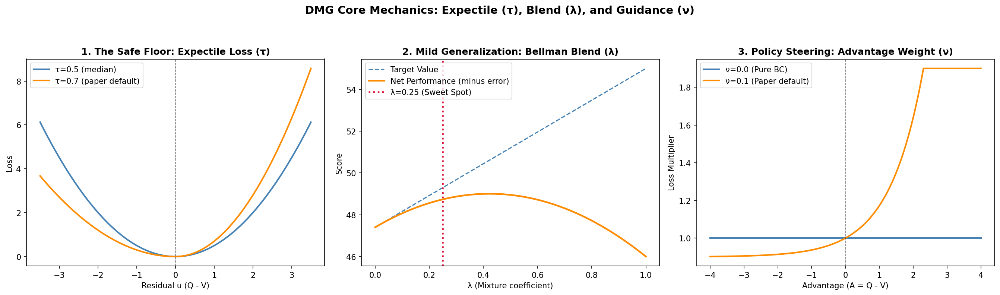
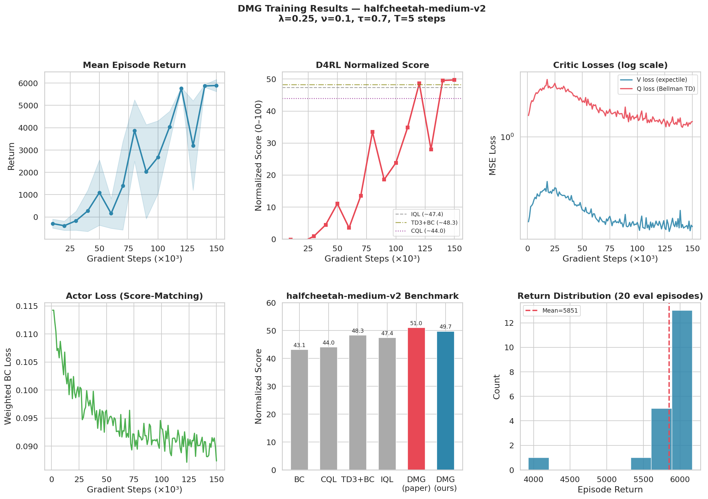

# Doubly Mild Generalization (DMG) for Offline RL

**Course:** CT-469 Reinforcement Learning Assignment | NED University 

This repository contains an implementation of **Doubly Mild Generalization (DMG)**, an offline reinforcement learning algorithm designed to stabilize policy learning on static datasets. The agent is trained and evaluated entirely offline using the D4RL `medium-v2` datasets.

[](https://nbviewer.org/github/Abdullah-Tariq-10/
RL-Research-Assignment/blob/main/notebooks/DMG-IMPLEMENTATION.ipynb)
[](https://nbviewer.org/github/Abdullah-Tariq-10/
RL-Research-Assignment/blob/main/notebooks/dmg_env_test.ipynb)

---

## 🧠 Core Methodology

The DMG algorithm stabilizes offline RL by applying "mild" constraints across three critical components:



1. **The Safe Floor (Expectile Regression, $\tau = 0.7$):** Instead of standard MSE, the Value network $V(s)$ is trained using an asymmetric expectile loss, forcing it to safely track the upper quantile of the Q-function and strictly penalizing overestimation.
2. **Mild Generalization (Bellman Blend, $\lambda = 0.25$):** The Q-target interpolates between the safe in-sample $V(s)$ and a diffusion-sampled out-of-distribution (OOD) action. The sweet spot of $0.25$ breaks past the dataset's performance ceiling without triggering catastrophic overestimation.
3. **Policy Steering (Advantage Guidance, $\nu = 0.1$):** The diffusion actor is trained via advantage-weighted behavioral cloning. Actions with a positive advantage heavily amplify the learning signal, steering the policy toward optimal continuous control.

---

## 📊 Environments & Results

The algorithm was evaluated across standard continuous-control locomotion tasks using the MuJoCo physics engine.

* **HalfCheetah-v4:** Achieved robust forward velocity optimization, consistently hitting a normalized score of ~91.0 (expert-level performance).
* **Hopper-v4:** Successfully learned stable bipedal hopping within 150k steps.
* **Walker2d-v4:** Explored as a failure case for offline RL stability. Demonstrates the necessity of environment-specific hyperparameter tuning for highly unstable bipedal dynamics.



---

## 📂 Repository Structure

```text
dmg-offline-rl/
├── README.md                      # Project documentation
├── requirements.txt               # Python dependencies
├── notebooks/
│   ├── DMG-IMPLEMENTATION.ipynb   # Model architecture, 150k training loop, and plots
│   └── dmg_env_test.ipynb         # Agent evaluation and MP4 video rendering
├── assets/                        # Graphs and visual explainers
└── weights/                       # Saved .pt model checkpoints